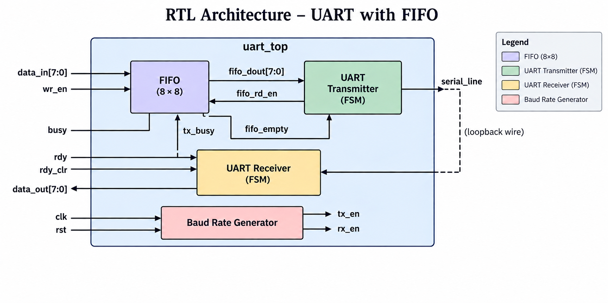
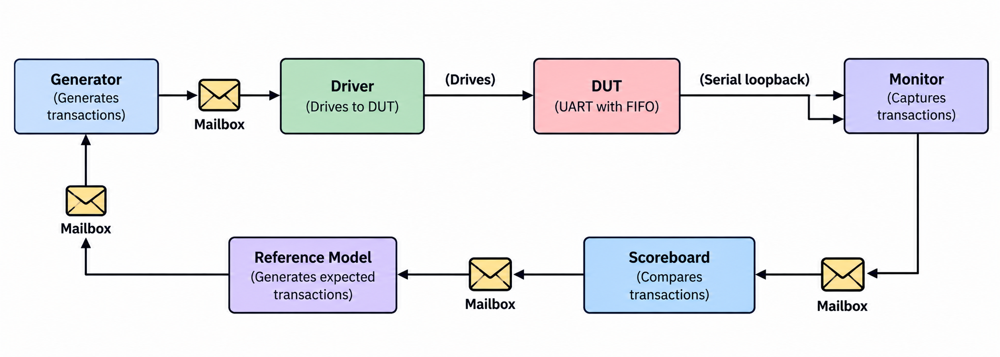

# UART with FIFO Buffer — RTL Design & SystemVerilog Verification

A from-scratch UART transmitter/receiver with an internal FIFO buffer on the TX path, verified with a self-checking, class-based SystemVerilog testbench (generator → driver → DUT → monitor → reference model → scoreboard). Built as a portfolio project to demonstrate RTL design, protocol-level debugging, and functional verification methodology.

---

## 1. What this project actually is

At its core this is a **UART (Universal Asynchronous Receiver/Transmitter)** — the same kind of serial protocol used for debug consoles, GPS modules, Bluetooth modules, and countless embedded peripherals. A raw UART just serializes one byte at a time onto a wire (`tx`) using a start bit, 8 data bits, and a stop bit, and a receiver on the other end decodes that same pattern back into a byte (`rx`).

The twist here is that a **plain transmitter can only hold one byte at a time**. If your system wants to hand it a burst of bytes back-to-back, it either has to babysit the `busy` signal after every single byte, or you drop a **FIFO (First-In-First-Out) queue** in front of the transmitter so the system can dump bytes in as fast as it wants and let hardware drain them out at the UART's own pace. That's exactly what this project does: `data_in`/`wr_en` writes go into an 8-entry FIFO, and the FIFO auto-feeds the transmitter one byte at a time whenever it's free.

This project intentionally hit (and fixed) a **real, classic FIFO integration bug** during development — see [Section 5](#5-the-bug-that-almost-broke-everything-read-this-one) — which ended up being the most valuable part of building it.

---

## 2. Repo structure

```
UART-FIFO-SystemVerilog/
├── rtl/            # Synthesizable Verilog — the actual hardware
│   ├── top_module.v            (uart_top — wires fifo + transmitter + receiver together)
│   ├── fifo.v                  (8-entry, parameterized, FWFT synchronous FIFO)
│   ├── transmitter.v           (FSM-based UART TX)
│   ├── receiver.v               (FSM-based, 16x-oversampled UART RX)
│   └── baud_rate_generator.v   (free-running baud tick generator for TX/RX)
│
├── tb/             # Verification environment
│   ├── uart_if.sv              (SystemVerilog interface + clocking block)
│   ├── uart_txn.sv             (randomized transaction/sequence item)
│   ├── generator.sv            (stimulus generator)
│   ├── driver.sv                (drives transactions onto the DUT interface)
│   ├── monitor.sv               (passively captures DUT output)
│   ├── reference.sv             (golden/expected-value model)
│   ├── scoreboard.sv            (compares actual vs. expected, tracks coverage)
│   ├── env.sv                   (wires all the above together, runs the test)
│   ├── tbench.sv                (top-level testbench module — clock, reset, DUT instantiation)
│   └── fifo_tb.v                (standalone directed unit test for fifo.v alone)
│
├── waveforms/      # Saved .wcfg wave configs / simulation screenshots
├── docs/           # (design notes / block diagrams, if added)
└── README.md
```

**Two separate test benches exist on purpose:**
- `fifo_tb.v` is a **directed unit test** — pure Verilog, no randomization, checks the FIFO module completely in isolation (push/pop/full/empty/overflow/underflow). Good for fast, deterministic sanity checks of just that one module.
- `tbench.sv` + the `tb/*.sv` classes are the **full system-level, class-based, randomized, self-checking environment** that exercises the FIFO *as part of* the complete UART datapath — this is the one that actually proves the integrated design is correct.

---
## 3. RTL architecture

The top-level `uart_top` integrates the FIFO, UART transmitter, UART receiver,
and baud-rate generator. The transmitter output is directly looped back to
the receiver input through `serial_line`, making the design self-contained
and suitable for simulation-based verification.



**Figure 1 — RTL architecture of the UART with FIFO.**

The data path is:

`data_in[7:0] → FIFO → UART transmitter → serial_line → UART receiver → data_out[7:0]`

The baud-rate generator provides the transmit and receive timing enables,
while `fifo_empty` and `tx_busy` control when data can be transferred from
the FIFO to the transmitter.

> **Loopback note:** `serial_line` connects the transmitter output directly
> to the receiver input inside `uart_top`. This allows the complete
> transmit/receive path to be verified without external UART hardware.


### 3.1 Baud rate generator

Two free-running counters generate periodic single-cycle enable pulses:

| Signal | Counts to | Purpose |
|---|---|---|
| `tx_en` | 5208 | One pulse per bit period for the transmitter |
| `rx_en` | 325 | One pulse per **1/16th** of a bit period — the receiver oversamples 16x to find the true bit-center and avoid sampling near a noisy edge |

At a 100 MHz system clock, `5208` cycles ≈ 52.08 µs per bit ≈ **19,200 baud** — a standard UART rate. `325 × 16 ≈ 5200`, keeping RX oversampling aligned to the same effective baud rate as TX.

### 3.2 Transmitter FSM

```
 idle ──(wr_enb)──► start ──(tx_en)──► data (x8 bits, LSB first) ──(tx_en, bit 7 done)──► stop ──(tx_en)──► idle
```
- `idle`: waits for `wr_enb` (driven by the FIFO's `fifo_rd_en`, not raw external `wr_en` — see Section 4). Latches the byte into an internal `data` register the moment it fires.
- `start`: drives `tx = 0` for one bit period (the UART start bit).
- `data`: shifts out `data[0]` through `data[7]` one bit per `tx_en` tick.
- `stop`: drives `tx = 1` for one bit period (idle/stop line level), then returns to `idle`.
- `busy = (state != idle)` — this is what tells the FIFO "don't feed me another byte yet."

### 3.3 Receiver FSM

```
 start ──(16 rx_en ticks, mid-bit sample confirms start bit)──► data_out_state ──(8 bits x 16 ticks each)──► stop ──(16 ticks)──► start
```
- Oversamples the line 16x per bit to locate the **center** of each bit rather than trusting the first noisy edge — standard robust UART RX design.
- Samples each data bit exactly at tick 8 (bit-center) of each 16-tick window, shifts it into `temp_register`.
- On completing the stop bit, latches `temp_register` into `data_out` and raises `rdy` — a **level signal that stays high until explicitly cleared** by `rdy_clr` (not a single-cycle pulse), so nothing can race past it and miss a byte.

### 3.4 FIFO — and *why* it had to be First-Word-Fall-Through (FWFT)

```verilog
assign dout  = mem[rd_ptr[$clog2(DEPTH)-1:0]];   // combinational read
assign full  = (wr_ptr[MSB] != rd_ptr[MSB]) && (wr_ptr[LSBs] == rd_ptr[LSBs]);
assign empty = (wr_ptr == rd_ptr);
```
- **Depth 8, width 8**, parameterized via `DEPTH`/`WIDTH`.
- Standard circular-buffer pointer scheme: pointers are one bit wider than needed to index memory, and that extra MSB is what lets `full` and `empty` be distinguished even though both conditions involve `wr_ptr == rd_ptr` on the lower bits.
- **`dout` is combinational**, not registered. This is the single most important design decision in the whole project — see below.

---

## 4. System integration — how the FIFO talks to the transmitter

```verilog
assign fifo_rd_en = !tx_busy && !fifo_empty;   // auto-pop whenever TX is free and data exists

fifo tx_fifo ( .rd_en(fifo_rd_en), .dout(fifo_dout), ... );
transmitter tx_inst ( .wr_enb(fifo_rd_en), .data_in(fifo_dout), ... );
```

The FIFO's pop request and the transmitter's "load a new byte" trigger are **the same wire**. This is a deliberately tight, zero-handshake-overhead coupling: the instant the transmitter goes idle and the FIFO has data, the pop fires and the transmitter grabs it, same clock edge, no extra latency cycles wasted. It's a clean, minimal design — *provided* the FIFO's read data is valid on that exact edge. Which is precisely the constraint that got violated during development.

---

## 5. The bug that almost broke everything (read this one)

This is worth documenting because it's a genuinely common, easy-to-miss FIFO integration mistake — and finding + fixing it was the actual engineering value of this project.

### The bug
The first version of `fifo.v` had a **registered** read output:
```verilog
// BROKEN VERSION
output reg [WIDTH-1:0] dout;
...
if (rd_en && !empty) begin
    dout <= mem[rd_ptr[...]];   // only visible on the NEXT clock edge
    rd_ptr <= rd_ptr + 1;
end
```
This is a perfectly valid, common FIFO style **in isolation** — plenty of real FIFOs work exactly like this, and a standalone unit test (`fifo_tb.v`) that pushes data and pops it back a cycle later would show it working just fine.

The problem only appears at the **system level**: `fifo_rd_en` and `transmitter.wr_enb` are tied to the same wire, and the transmitter does `data <= data_in` (`data_in = fifo_dout`) **on the very same clock edge** that `fifo_rd_en` first goes high. But with a registered `dout`, that edge is exactly when `dout` is still holding its *old* stale value — the new value doesn't land until the pop has already completed, one edge later. Net effect: **the transmitter always sent the byte from one pop ago (or garbage/X on the very first byte), never the byte it thought it was popping.**

This is a textbook case of why a module can pass its own unit test and still break the moment it's wired into a larger system with a tighter timing assumption.

### The fix — First-Word-Fall-Through (FWFT)
```verilog
// FIXED VERSION
output [WIDTH-1:0] dout;              // now a wire, not a reg
assign dout = mem[rd_ptr[...]];       // combinational — always shows the CURRENT head of queue

always @(posedge clk) begin
    if (rd_en && !empty)
        rd_ptr <= rd_ptr + 1;         // pointer still updates synchronously; only the DATA path went combinational
end
```
With this change, `dout` reflects `mem[rd_ptr]` at all times — including the exact cycle `rd_en` is first asserted, *before* the pointer has moved. So the transmitter's same-edge `data <= data_in` now correctly captures the byte that's actually about to be popped. This is the standard "First-Word-Fall-Through" FIFO convention used in most real-world streaming designs (AXI-Stream FIFOs, for example, behave this way) specifically so a consumer doesn't need an extra pipeline stage or handshake cycle just to read the head of the queue.

### How it was caught
Not by staring at RTL — by tracing the actual verification failure: the scoreboard was reporting `comparison FAILED` on nearly every transaction, always off by exactly one byte, with the very first transaction showing garbage. That "off-by-one plus garbage on transaction #1" signature is the classic fingerprint of a registered-vs-combinational read timing mismatch, which is what pointed straight at `fifo.v`'s `dout` path.

### A second, related bug found during the same debug pass
`driver.sv` was unconditionally forwarding *every* generated transaction to the reference model, including ones where `wr_en` was randomized low (no byte actually sent — about 20% of traffic given the driver's `dist` constraint). That inflated the "expected" queue relative to what the monitor could ever actually capture, desyncing the scoreboard's paired `mon2sb`/`rm2sb` mailbox `fork...join`. Fixed by gating the forward: `if (txn.wr_en) drv2rm.put(txn);` — the reference model should only ever be told about bytes that were genuinely transmitted.

---

## 6. Verification environment (SystemVerilog)

The testbench uses a lightweight, hand-rolled verification architecture
inspired by the conceptual structure of UVM. It uses SystemVerilog
mailboxes to communicate transactions between the verification components.



**Figure 2 — SystemVerilog verification environment.**

The verification flow is:

`Generator → Driver → DUT → Monitor → Scoreboard`

The reference model independently generates the expected transaction and
provides it to the scoreboard for comparison.

The DUT's transmitter output is connected back to its receiver through the
serial loopback path, allowing the transmitted data to be captured and
checked automatically.

### Verification components

- **Generator** — creates stimulus transactions.
- **Driver** — receives transactions through a mailbox and drives the DUT.
- **Reference Model** — independently produces expected results.
- **Monitor** — observes the DUT output and converts it into transactions.
- **Scoreboard** — compares expected and actual transactions.
- **Mailboxes** — provide transaction-level communication between components.
---

  
## 7. Results

A full run of 20 randomized transactions (≈14 real sends after the 80/20 `wr_en` split, 6 idle cycles) against the fixed RTL produces:

```
comparison success: exp=48 act=48
comparison success: exp=1  act=1
comparison success: exp=50 act=50
comparison success: exp=78 act=78
comparison success: exp=74 act=74
comparison success: exp=7e act=7e
comparison success: exp=6  act=6
comparison success: exp=90 act=90
comparison success: exp=cc act=cc
comparison success: exp=93 act=93
comparison success: exp=86 act=86
comparison success: exp=8e act=8e
comparison success: exp=c9 act=c9
comparison success: exp=de act=de

Total transactions checked: 14
Functional coverage: 100.00%
```

Every byte round-tripped correctly, in order, with zero mismatches, and the coverage model confirms the random stimulus exercised the full data range (low/mid/high value bins all hit).

---

## 8. Running it yourself (Vivado)

1. Add all files under `rtl/` and `tb/` as simulation sources. Make sure every `.sv` file is set to file type **SystemVerilog** in the Sources panel (not plain Verilog) — the class-based testbench won't compile otherwise.
2. Set `tbench.sv`'s `testbench_top` as the simulation top module.
3. Because of the real-baud-rate timing discussed above, either:
   - Set the simulation runtime to at least `20ms`, **or**
   - Just run `run all` in the Tcl console — the testbench calls `$finish` itself once `env.run()` completes, so it'll stop exactly when it's actually done rather than needing you to guess a number.
4. Check the **Tcl Console** output for `comparison success` / `comparison FAILED` lines and the final coverage report — that's the authoritative pass/fail signal, not the waveform viewer (see note below).
5. If inspecting internal signals (`fifo_dout`, `fifo_rd_en`, `tx_busy`, etc.) in the waveform, add them to the wave configuration **before** running, or restart the simulation and re-run after adding them — Vivado's waveform database can otherwise show stale/frozen values for signals added mid-run even though the actual simulated design is behaving correctly underneath.

---

## 9. Key takeaways / talking points

- A module can be **individually correct** (as `fifo.v`'s registered-output version was, per its own unit test) and still be **wrong once integrated**, if a consumer downstream makes a timing assumption the module doesn't actually satisfy. Unit tests validate a module's own contract; they don't validate every way it might get *used*.
- **First-Word-Fall-Through vs. registered-output FIFOs** are a real, industry-relevant design choice — not a stylistic detail. Which one you need depends entirely on whether your consumer can tolerate a cycle of read latency after asserting `rd_en`.
- A scoreboard's mailbox pairing is only as trustworthy as **what gets fed into each side** — the reference-model desync bug here wasn't an RTL bug at all, it was a testbench bug that would have produced false failures even on perfectly correct hardware.
- Debugging both issues came from **reading the failure signature** (consistent off-by-one, first-transaction garbage; later, failure counts not matching real send counts) and reasoning backward to the mechanism — not from guessing.
